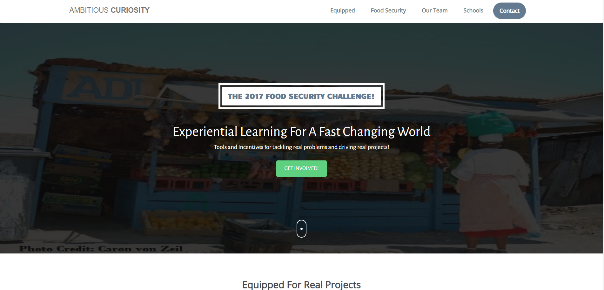
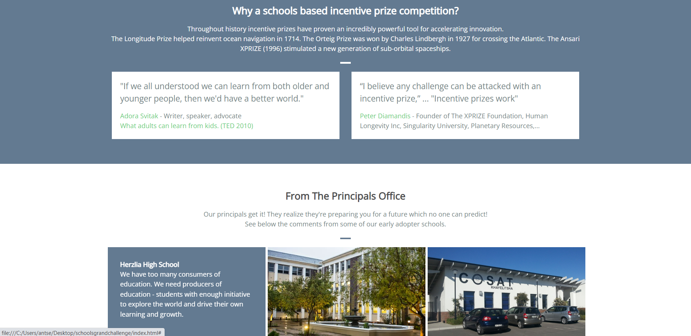

Back in 2017, I'd been dabbling with some software development, and needed a site for a project I was running with schools. 
This is the result. A 1-page responsive site using a Bootstrap template. It's not the most beautiful thing ever, but at least it shows that I can Bootstrap, HTML, and CSS. And yes, those are verbs. :) 

...

